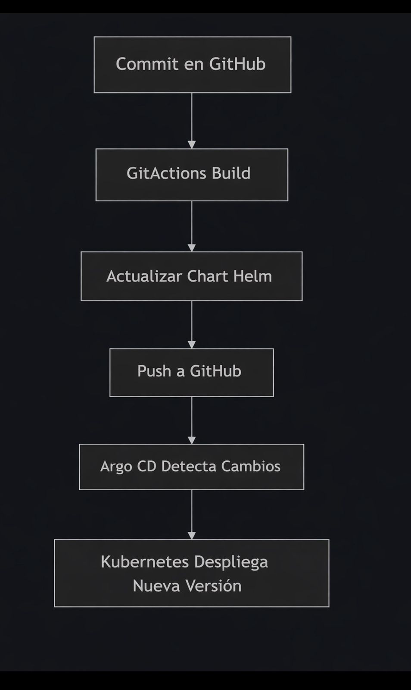

# K8S-DEVOPS

Proyecto de infraestructura y despliegue GitOps de un microservicio REST usando Kubernetes, Helm, ArgoCD y GitHub Actions.

## Docente

Daniel Orlando Saavedra Fonnegra

## Integrantes

- Nestor Alejandro Rodriguez Benavides
- Leidy Catherine Becerra Muñoz
- Peter Alexander Palacios Garnica

## Componentes implementados

| Módulo             | Descripción                                                                       | Tipo            |
| ------------------ | --------------------------------------------------------------------------------- | --------------- |
| `api-microservice` | Microservicio REST multi-ambiente con health probes, Dockerfile y pipeline CI/CD  | Aplicación      |
| `k8s_server`       | Infraestructura declarativa: manifests base + Helm chart con valores por ambiente | Infraestructura |

## Cómo ejecutar

### api-microservice

Microservicio construido con **FastAPI**. Expone endpoints de negocio y health probes para Kubernetes. El ambiente (`dev`/`prod`) se inyecta como variable de entorno en el build.

```bash
# Local
cd api-microservice
pip install -r requirements.txt
uvicorn app.main:app --reload --port 8000

# Docker — dev
docker build --build-arg APP_ENV=dev -t api-microservice:dev ./api-microservice
docker run -p 8000:8000 api-microservice:dev

# Docker — prod
docker build --build-arg APP_ENV=prod -t api-microservice:prod ./api-microservice
docker run -p 8000:8000 api-microservice:prod
```

> Ver documentación completa en [`api-microservice/README.md`](./api-microservice/README.md)

---

### k8s_server

Repositorio de infraestructura con un **Helm chart** parametrizado para los ambientes `dev` y `prod`. ArgoCD monitorea los `values` files y sincroniza el clúster automáticamente cuando GitHub Actions actualiza el tag de imagen tras cada push.

```bash
# Despliegue dev
kubectl create namespace api-dev
helm install api-dev ./k8s_server/k8s/charts/api-microservice \
  -n api-dev \
  -f k8s_server/k8s/charts/api-microservice/values.dev.yaml

# Despliegue prod
kubectl create namespace api-prod
helm install api-prod ./k8s_server/k8s/charts/api-microservice \
  -n api-prod \
  -f k8s_server/k8s/charts/api-microservice/values.prod.yaml
```

> Ver documentación completa en [`k8s_server/README.md`](./k8s_server/README.md)

---

Flujo CI/CD con GitActions y Argo CD
Desarrollo: al realizar un commit en la rama principal (main), GitActions se activa.
Construcción: GitActions construye la imagen Docker y la publica en el registro.
Actualización: GitActions actualiza la versión de la imagen en el chart de Helm.
Sincronización: Argo CD detecta el cambio en Git y despliega la nueva versión automáticamente.

## Flujo GitOps


